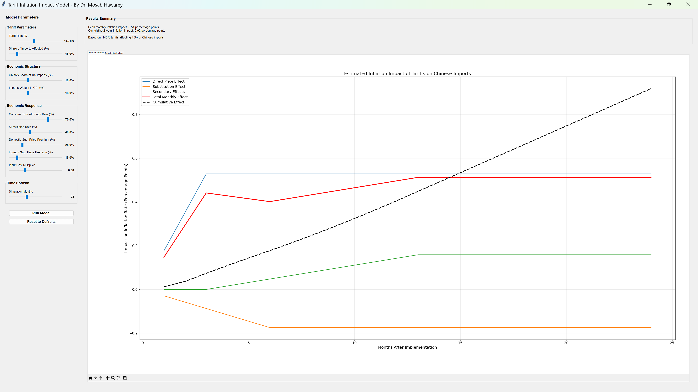
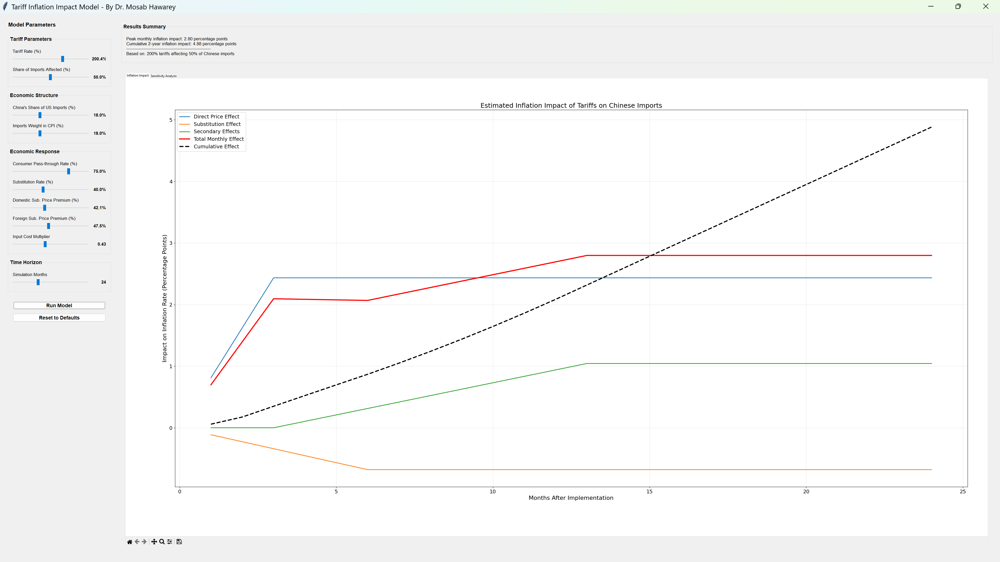
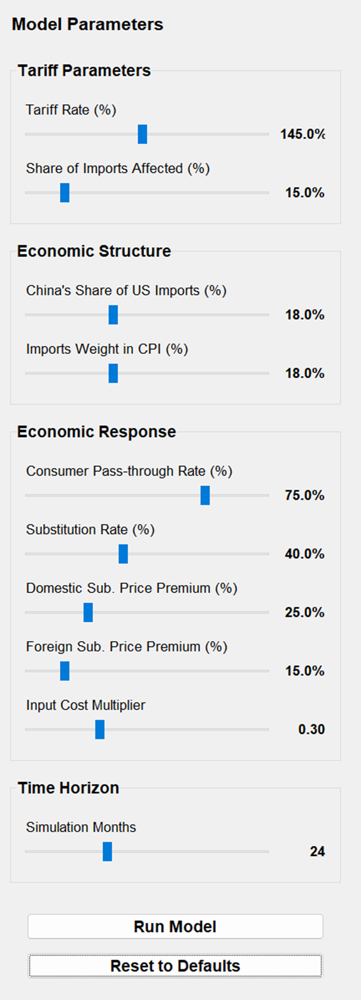
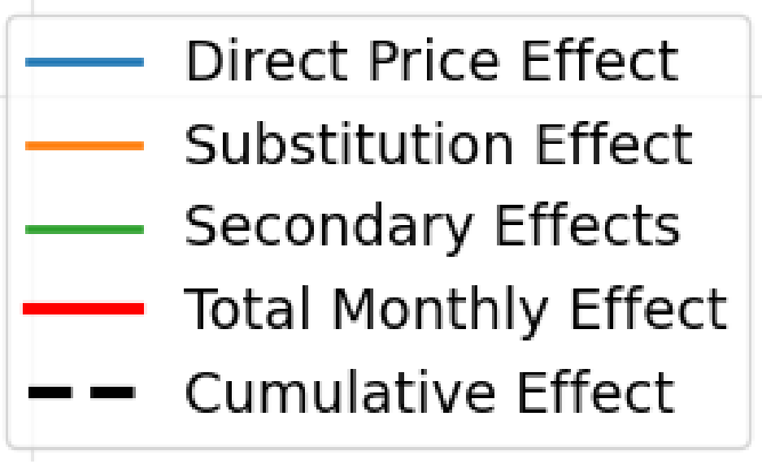

# Tariff Inflation Impact Model

An interactive economic model simulating the inflationary impact of tariffs on Chinese imports to the US economy. Features sensitivity analysis across key parameters with real-time visualization.

## Screenshots

<p align="center">
  &nbsp;&nbsp;
</p>
<p align="center">
  &nbsp;&nbsp;
</p>

## Features

- **Multi-Channel Impact Modeling** — Direct price effects, substitution dynamics, and secondary input-cost propagation
- **Temporal Dynamics** — Phase-in lags for direct effects (3 months), substitution (6 months), and secondary effects (10 months)
- **Sensitivity Analysis** — Parameter sweeps across tariff rate, import share, pass-through rate, and substitution rate
- **Interactive Dashboard** — Tkinter GUI with adjustable sliders for all 10 model parameters
- **Dual-Tab Visualization** — Inflation impact over time + sensitivity analysis charts

## Model Parameters

| Parameter | Default | Description |
|-----------|---------|-------------|
| Tariff Rate | 145% | Applied tariff on Chinese imports |
| Affected Imports Share | 15% | Share of Chinese imports subject to tariffs |
| China Import Share | 18% | China's share of total US imports |
| Import CPI Weight | 18% | Weight of imports in CPI basket |
| Pass-through Rate | 75% | Share of tariff passed to consumers |
| Substitution Rate | 40% | Rate of switching to non-Chinese sources |

## Requirements

```
numpy
pandas
matplotlib
tkinter (included with Python)
```

## Usage

```bash
pip install numpy pandas matplotlib
python tariff_model.py
```

## Author

**Dr. Mosab Hawarey** — [github.com/mhawarey](https://github.com/mhawarey)

## License

MIT License
